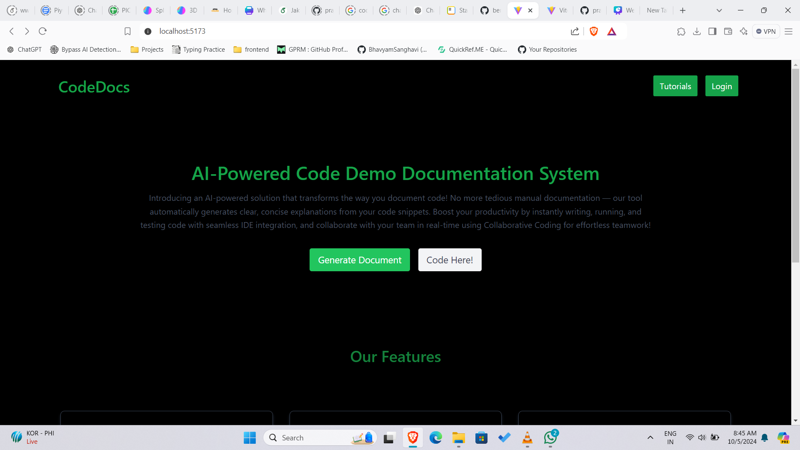
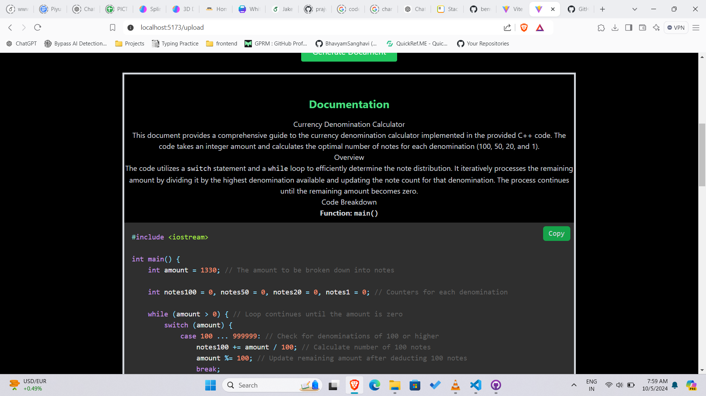
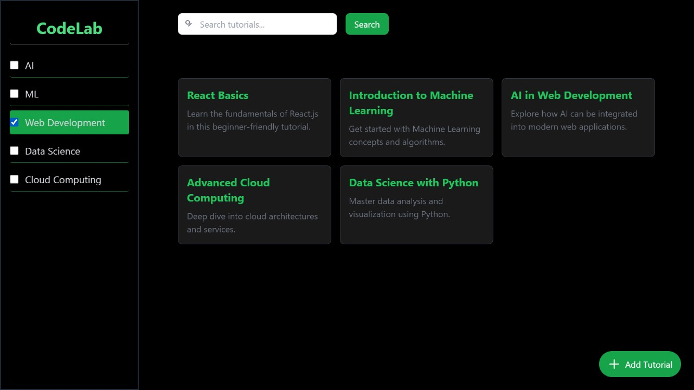
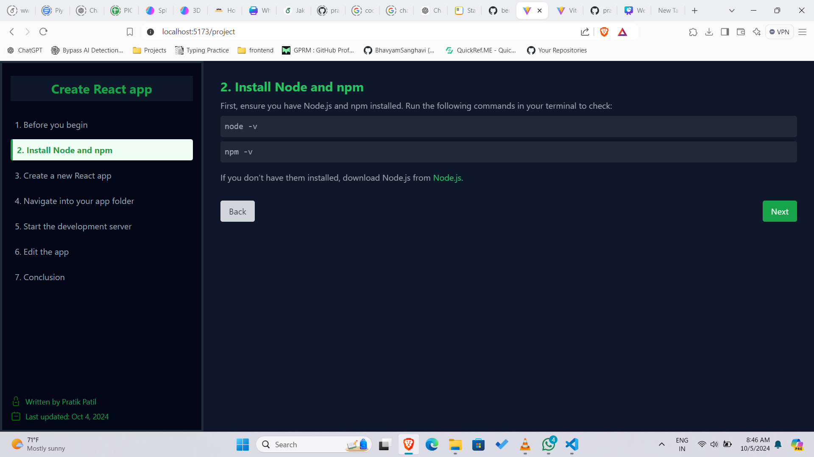
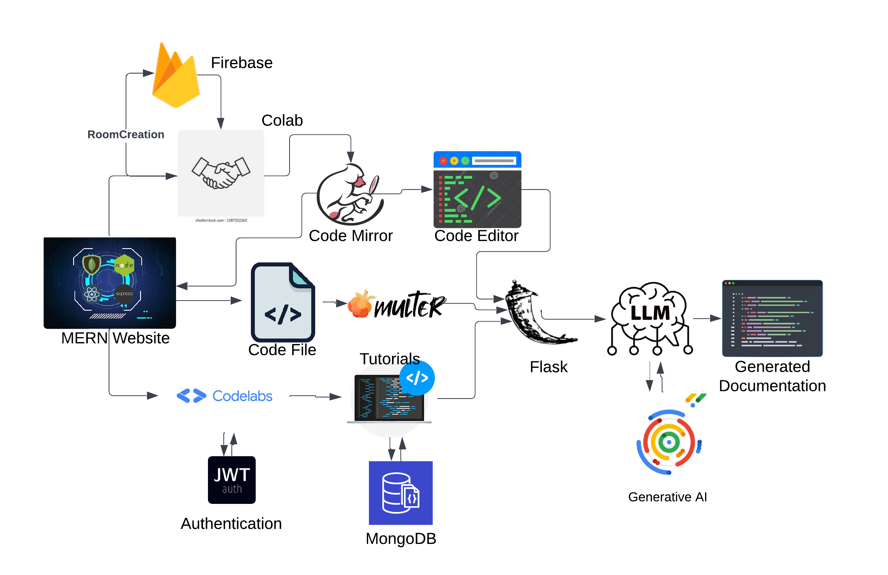

# Pulazion-Web-and-App-CodeScriptors

## Landing Page



## Documentation with custom prompt


## Documentation Generated according to the custom prompt



## Room creation collaborative IDE


## IDE With Code Generator


## CodeLabs



## Tutorials



## Flowchart



### Setup to the project

1. **Add your Firebase server keys in frontend/.env**:
   ```bash
    CORS_ORIGIN=*
    VITE_FIREBASE_API_KEY=
    VITE_FIREBASE_AUTH_DOMAIN=
    VITE_FIREBASE_PROJECT_ID=
    VITE_FIREBASE_STORAGE_BUCKET=
    VITE_FIREBASE_MESSAGING_SENDER_ID=
    VITE_FIREBASE_APP_ID=
    VITE_FIREBASE_MEASUREMENT_ID=
    ```
